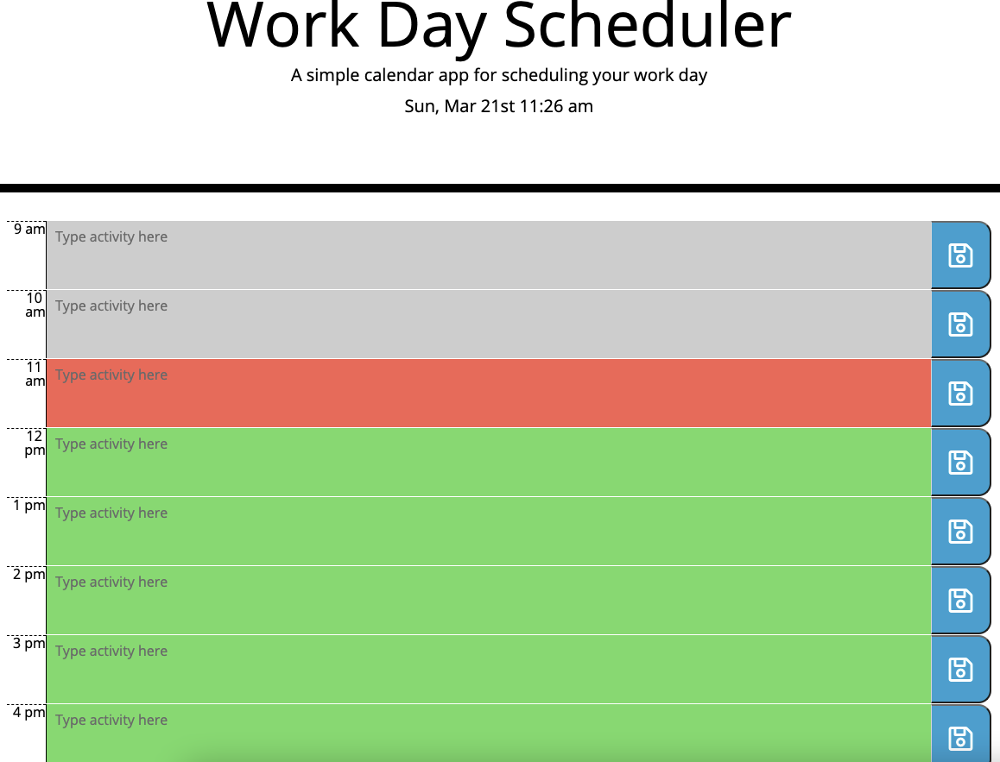

# workd-day-scheduler

> A simple tool to help plan tasks for the day.

## Link

## Features

Key features of the scheduler
* Ability to create, view and update tasks for each hour of the working day
* The colour of the input areas updates dynamically throughout the day
    * Red represents the current hour
    * Green is future and grey is in the past
* Created tasks persist when the browser is refreshed

## Development

I took this project on to practice my knowledge of  third party APIs and how they can be used to enhance the experience and interactivity of a web site.

The application uses the Moment.js API which allowed me to create and format the time blocks based on the hour of day. 

The rest of the logic behind the project was done using JavaScript and jQuery, and the style and layout is proviced by CSS, Bootstrap and HTML. There's also an icon from Fontawesome used for the save button.

## Challenges 

The biggest challenge came toward the end when I needed a way to store the text typed in the text area to local storage, and then display the stored items in the correct boxes on screen.

My first attempt resulted in multiple items with the same data-attribute hour value being saved to storage which made the subsequent loop block to render the tasks difficult to implement and so I needed a new way to create the tasks. At this point I took a step back from the actual coding and typed out the key functions in pseudo code.

In the end I decided to set up the array of tasks with placeholder objects for each hour of the day. The save function then checks which data-attribute hour has been clicked and updates the text value of the corresponding object within the array. 

To display the stored tasks in the correct blocks I realised I could build on a technique used in a a previous project (JavaScript Coding Quiz) and sort the array by the data-hour attribute and loop through each element to update the time blocks. 

## Final thoughts

This project really tested my skills as a developer and I found myself scratching my head at numerous stages throughout the development.

My main learning point from this exercise is to not underestimate the advantages of pseudo code. Once I'd talked through the challenges out loud and written them out in simple lines of text, I was able to start prototyping blocks of code and using console.log to check functionality.

